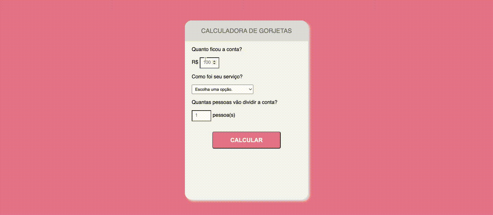

# 📌 CALCULATING TIPS

* 📑 [Descrição](#descrição)
* 🔛 [Demo](#demo)
* 💻 [Tecnologias](#tecnologias)
* 🔨 [Funcionalidades](#funcionalidades)
* 📋 [Execução](#execução)
* :octocat: [Autores](#autores)
  
## Descrição

Aplicação simples, reunindo conceitos básicos de HTML, CSS e Javascript, para calcular gorjetas de acordo com o número de pessoas e o nível de satisfação do serviço.

## Demo

## Tecnologias
  

## Funcionalidades
- `Funcionalidade 1`: Captar dados do usuário em um formulário.
- `Funcionalidade 2`: Validar se campos foram preenchidos antes do cálculo.
- `Funcionalidade 3`: Calcular quanto de gorjeta ficará para cada pessoa na mesa, de acordo com o valor da conta e o nível de satisfação do serviço.
- `Funcionalidade 4`: Exibir o valor do cálculo, após clicar no botão de calcular.

## Execução
- `Passo 1`: Baixar o projeto.
- `Passo 2`: No prompt de comando, executar o comando `npm start`.

## Autores
| [ Juan Carlos](https://github.com/juan-soaraes) |
| :---: |
